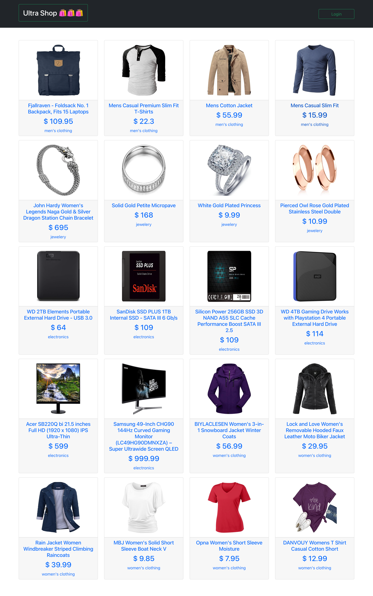
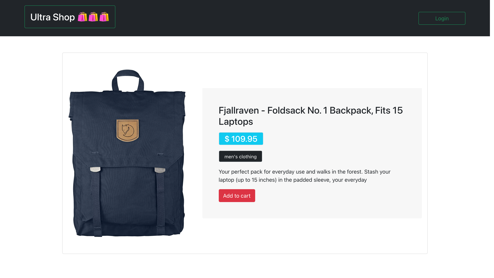

# Ultra Shop

This is a beginner level project for who learn and start with react redux.

### Tools & Technology:

``` bash
* React JS
* Redux (State Management)
* [Fake Store Api](#https://fakestoreapi.com/)
* [React Component Loader](#https://github.com/danilowoz/react-content-loader)
```

# Project UI

## Home Page



## Details Page



## For Observation this project
``` bash
* [clone this github repo](#https://github.com/anik1612/react-redux-ultrashop)
  git clone https://github.com/anik1612/react-redux-ultrashop 

* npm install or yarn install

* npm start or yarn start

* go to http://localhost:3000/ 

```
